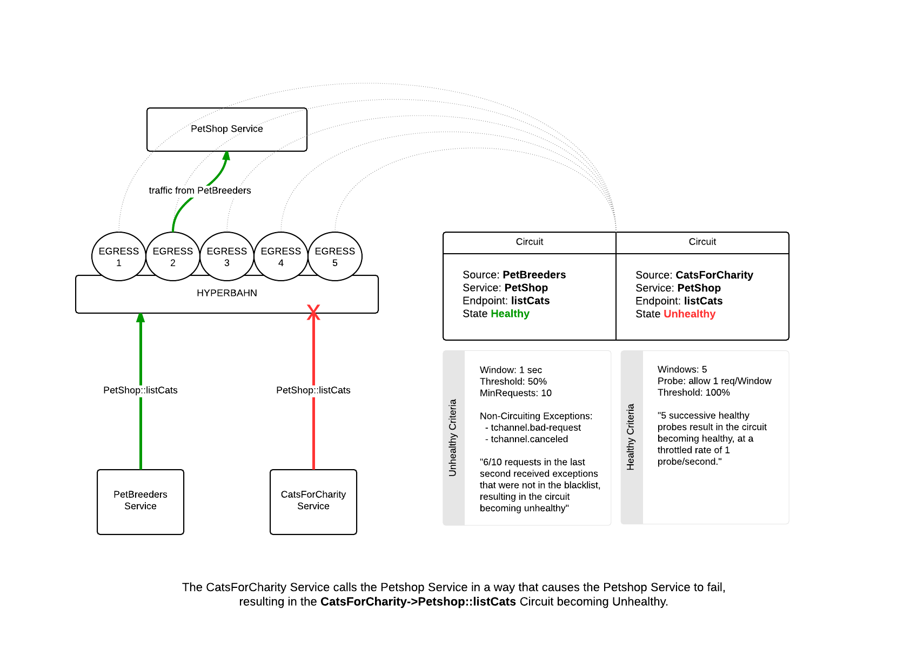
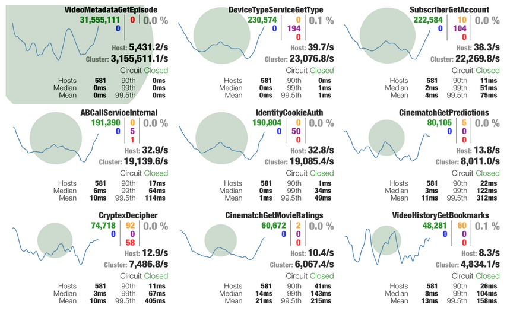

# Circuit Breaking

This document outlines how Hyperbahn's [Circuit
Breaking](http://martinfowler.com/bliki/CircuitBreaker.html) mechanism is
designed to:

* Stop cascading failures in a complex distributed system.
* Fail fast and rapidly recover.
* Fallback and gracefully degrade when possible.
* Enable near real-time monitoring, alerting, and operational control.

The terminology and ideas described here are adapted from the popular JVM
resiliancy library, [Netflix's
Hystrix](https://github.com/Netflix/Hystrix/wiki), and the excellent book
["Release it!" by M. Nygard](http://www.amazon.com/gp/product/0978739213).

## The Problem

Applications in complex distributed architectures have dozens of dependencies,
each of which will inevitably fail at some point. If the host application is
not isolated from these external failures, it risks being taken down with them.

For example, for an application that depends on 30 services where each service
has 99.99% uptime, here is what you can expect:

>99.9930  =  99.7% uptime
>0.3% of 1 billion requests = 3,000,000 failures
>2+ hours downtime/month even if all dependencies have excellent uptime.

Reality is generally worse.

Even when all dependencies perform well the aggregate impact of even 0.01%
downtime on each of dozens of services equates to potentially hours a month of
downtime __if you do not engineer the whole system for resilience__.

## The Solution

The [Circuit Breaker
Pattern](http://martinfowler.com/bliki/CircuitBreaker.html) prevents system
failure and unacceptable latency from propagating throughout a distributed
system. It does this by:

1. Defining a services' circuits. By dividing a service up into logical parts
   that can fail independently, part of a service can be downed, while other
   parts continue to function.
2. Tracking requests stats (success, failure, average latency, etc) made to
   Services.
3. Marking Circuits as Unhealthy when stats pass the Unhealthy Criteria check.
   Circuits that are Unhealthy deny traffic - this affords failing systems
   "room to breathe" so that they are not bombarded by doomed requests.
4. Marking Circuits as Healthy when stats pass the Healthy Criteria check. This
   involves setting a health probe that must succeed X times before marking the
   Circuit as Healthy.
5. Allow monitoring of all Circuits, a "birds-eye" dashboard of the entire
   distributed system, and the ability to manually adjust Circuit state and
   parameters.

### Terminology

The jargon associated with Circuit Breaking makes the problem area more
difficult to understand than it should be. To combat this, the following terms
will be strictly used:

| Term               | Definition                                                                          | Synonyms                      |
| ------------------ | ----------------------------------------------------------------------------------- | ----------------------------- |
| Caller             | A Service that is calling into another Service through a Circuit.                   | Source                        |
| Circuit            | A unit that throttles traffic based on whether it is in Healthy or Unhealthy State. | Breaker, Bulkhead             |
| Healthy            | A circuit state when traffic is flowing regularly.                                  | Closed Circuit, Reset Circuit |
| Healthy Criteria   | A check that is used to determine when a Circuit should become Healthy.             |                               |
| Probe              | A regular request that acts as a health check when a circuit is Unhealthy.          | Health Check                  |
| Service            | An API/application that is using the Circuit Breaker pattern.                       | System, API, application      |
| Unhealthy          | A circuit state when traffic is being denied, with occasional requests, called probes, being let through as health checks. | Open Circuit, Half-open Circuit |
| Unhealthy Criteria | A check that is used to determine when a Circuit should become Unhealthy.           |                               |

Phrases like "trip the circuit", "break the circuit", and "reset the circuit"
are all explicitly avoided, instead opting for the more obvious "Healthy state
change" and "Unhealthy state change".

## Implementation

The following diagram illustrates Hyperbahn's Circuit Breaking implementation:

[Click Here For Full Size Diagram](images/circuit_breaking.png)

* Each Service that is registered on the Hyperbahn maintains a set of Circuits
  that are responsible for denying traffic when the Circuit is Unhealthy.
* The Circuits live on the Service's Egress nodes so that traffic can be denied
  before reaching the Service. The state of the Circuits can be optionally
  gossiped between that Service's Egress nodes to enhance the Circuit's
  sensitivity.
* The Service maintains a Circuit for every Caller it has, times every endpoint
  it exposes, with a name format of `CALLER->SERVICE::ENDPOINT`. In our
  diagram, this means that even though the `CatsForCharity->Petshop::listCats`
  Circuit is Unhealthy and denying traffic, the
  `PetBreeders->Petshop::listCats` Circuit is Healthy and continues to allow
  traffic to flow.
* Circuits periodically inspect request stats in order to determine whether
  they are Healthy or Unhealthy. Healthy Circuits allow traffic regularly,
  while Unhealthy Circuits deny traffic, only letting an occasional request in
  every so often to act as a health check.

### Unhealthy Criteria

Healthy Circuits check their stats incrementally using the following criteria
to determine if the Circuit should become Unhealthy:

| Parameter                 | How it's used                                              | Example                                      |
| ------------------------- | ---------------------------------------------------------- | -------------------------------------------- |
| `Window`                  | Period of time to sample request stats from.               | 1 second                                     |
| `Threshold`               | How many requests must fail within the Window.             | 50%                                          |
| `MinRequests`             | Minimum amount of requests before Window can be checked.   | 10                                           |
| `NonCircuitingExceptions` | Valid exceptions that do not contribute to circuit health. | `tchannel.bad-request`, `tchannel.cancelled` |

### Healthy Criteria

Unhealthy Circuits check their stats incrementally using the following criteria
to determine if the Circuit should become Healthy again:

| Parameter               | How it's used                                              | Example      |
| ----------------------- | ---------------------------------------------------------- | ------------ |
| `Windows`               | Amount of Windows where the health check has to pass.      | 5            |
| `ProbeRate`             | How many requests to let through to act as a health check. | 1 per second |
| `Threshold`             | How many probes must succeed.                              | 100%         |

### Monitoring

TBD:

* How to surface all Circuit stats and state in near realtime.
* How to allow manual changes to Circuit parameters and state.
* How to alert on Circuit state changes.
* How to influence Circuit parameters over time.

Check out [Hystrix's Dashboard](https://github.com/Netflix/Hystrix/tree/master/hystrix-dashboard) for inspiration:

## Scenarios

The following table uses the Service's shown in the implementation diagram and
details how Hyperbahn reacts to common failure scenarios:

| Scenario | Outcome |
| -------- | ------- |
| A server has hardware failure. | Services living on the failed server will lose their open connections to Hyperbahn and will cease to receive traffic. |
| A change in the Petshop Service results in calls to some/all endpoints to fail for all Callers. | Incoming calls to the now failing Petshop Service will result in the Circuit for each Caller->endpoint interaction to become Unhealthy. Circuit alerts will prompt engineers that something is wrong, and traffic will be denied to the failing endpoints (except for nominal healthchecks) until the Petshop Service is fixed.
| A change in the Petshop Service results in unacceptable latency seen in calls to some/all endpoints for all Callers. | Because timeouts are treated the same as failure, the outcome will be similar to that of Scenario #2. Callers provide a TTL for how long they are willing to wait for a response, anything outside that TTL is treated as failure. If the Petshop Service exceeds dependencies expectations, this could result in those Circuits being marked as unhealthy. |
| A change in how CatsForCharity calls Petshop results in calls to Petshop::listCats to fail. | When enough failed calls occur, the `CatsForCharity->Petshop::listCats` Circuit will become unhealthy. Circuit alerts will prompt engineers that something is wrong, and traffic from CatsForCharity will be denied to the Petshop::listCats endpoint (except for nominal healthchecks) until the CatsForCharity Service is fixed. |
| A change in how CatsForCharity calls Petshop results in unacceptable latency in calls to Petshop::listCats. | When enough timeouts occur, the `CatsForCharity->Petshop::listCats` Circuit will become unhealthy. Circuit alerts will prompt engineers that something is wrong, and traffic from CatsForCharity will be denied to the Petshop::listCats endpoint (except for nominal healthchecks) until the CatsForCharity Service is fixed. |
| Intermittent network weather causes the Petshop Service to become unacceptably latent for all Callers. | Incoming calls that are timing out will eventually cause the `CALLER->Petshop::latentMethod` Circuits to become unhealthy. Circuit alerts will prompt engineers that something is wrong, and the Petshop Service will deny traffic to all Callers that experienced latent calls until the Circuits automatically become Healthy again. Diagnosis should occur afterwards, and the root cause of the network weather fixed. |

## Challenges

* Tuning Circuit parameters is hard. Different Service's often require
  different Circuit parameters in order to behave as desired, not be over or
  under sensitive. Often these parameters are best known by Service authors
  themselves. Tuning Circuit parameters automatically is probably even more
  difficult.
* Very granular Circuits (a Circuit for every `CALLER->SERVICE::ENDPOINT`
  combination) means lots of Circuits. Controlling these manually when needed
  will not be trivial. Ability to control many circuits by Service, for example
  to disable all of PetShops Circuits, or all Circuits in general, will
  probably be needed.
* Sharing Circuit state between Egress nodes signifies much network traffic and
  makes this problem rather complex.
* Viewing "birds-eye" Circuit stats for an entire system means looking at EVERY
  Circuit in every Egress node.
